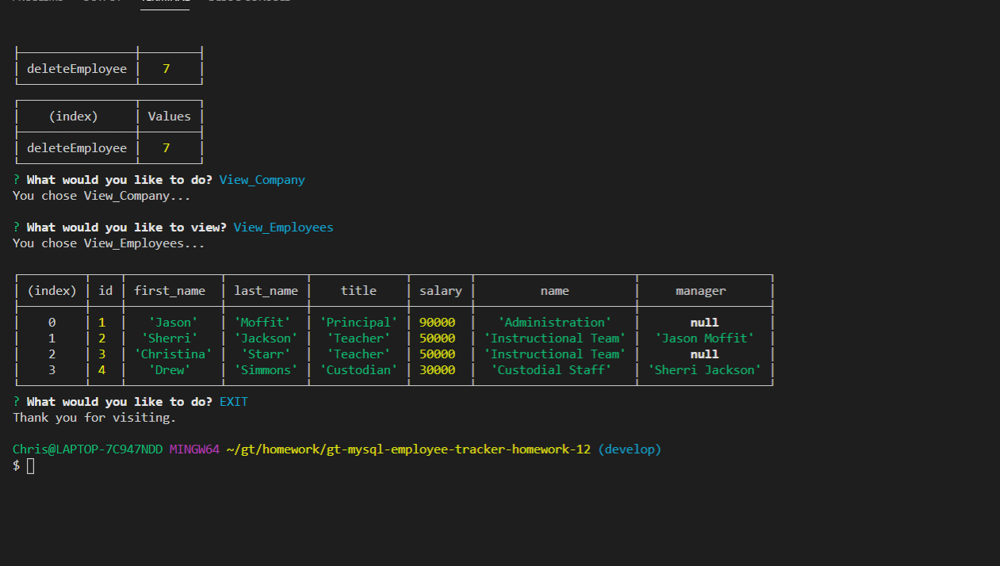

# Employee Database using MySQL, Express and NodeJS

## Table of Contents

- [Installation](#installation)
- [Usage](#usage)
- [Credits](#credits)
- [MIT_License](#mit_license)

## Installation

1. Clone the repo,
2. In the repo, run npm install and,
3. Run the app.js file in your terminal using 'node app.js'.

## Usage

This Employee Database was designed to run on a Node Command Line Interface(CLI). It retrieves information from the user and inputs their data dynamically into a database within MySQL. It's the perfect way to keep track of multiple people within different sections of an organization. It was also designed to meet the criteria for GT Full-stack Flex program homework requirements.

Link to screen recording:

[Team Profile Generator](https://drive.google.com/file/d/14FCGNsue6MdWY3NH-5l7uqWY-5DVo7d5/view)

## Credits

This was a solo project completed as homework for the Georgia Tech, FullStack Flex program. However, I
recieved insight on how to generate an array of manager and role choices, using the .map prototype by my tutor, Kevin Ferguson.

## MIT_License

Copyright (c) [2020][christina cunningham starr]

Permission is hereby granted, free of charge, to any person obtaining a copy
of this software and associated documentation files (the "Software"), to deal
in the Software without restriction, including without limitation the rights
to use, copy, modify, merge, publish, distribute, sublicense, and/or sell
copies of the Software, and to permit persons to whom the Software is
furnished to do so, subject to the following conditions:

The above copyright notice and this permission notice shall be included in all
copies or substantial portions of the Software.

THE SOFTWARE IS PROVIDED "AS IS", WITHOUT WARRANTY OF ANY KIND, EXPRESS OR
IMPLIED, INCLUDING BUT NOT LIMITED TO THE WARRANTIES OF MERCHANTABILITY,
FITNESS FOR A PARTICULAR PURPOSE AND NONINFRINGEMENT. IN NO EVENT SHALL THE
AUTHORS OR COPYRIGHT HOLDERS BE LIABLE FOR ANY CLAIM, DAMAGES OR OTHER
LIABILITY, WHETHER IN AN ACTION OF CONTRACT, TORT OR OTHERWISE, ARISING FROM,
OUT OF OR IN CONNECTION WITH THE SOFTWARE OR THE USE OR OTHER DEALINGS IN THE
SOFTWARE.
